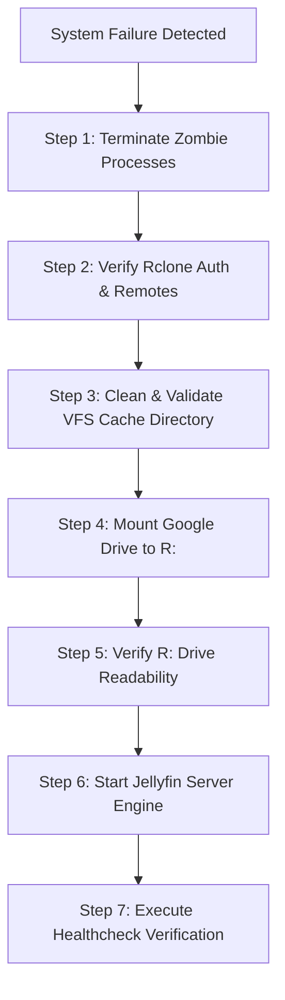

# Disaster Recovery and Maintenance Playbook

This document defines standard operating procedures (SOP), automated maintenance scripts, and troubleshooting protocols for the MHJoy Media Server ecosystem (Jellyfin Server + Rclone VFS Google Drive Mount + NVMe Cache).

---

## Table of Contents
1. [Architecture Overview & Key Paths](#1-architecture-overview--key-paths)
2. [Disaster Recovery Runbook (Step-by-Step)](#2-disaster-recovery-runbook-step-by-step)
3. [Google Drive Token Expiration & Re-Authentication](#3-google-drive-token-expiration--re-authentication)
4. [Windows Service Failures & Boot Recovery](#4-windows-service-failures--boot-recovery)
5. [Cache Corruption Recovery & Clean Purging](#5-cache-corruption-recovery--clean-purging)
6. [Library Rebuild & SQLite Database Maintenance (Vacuum)](#6-library-rebuild--sqlite-database-maintenance-vacuum)
7. [Healthcheck Commands & Automated Monitoring Scripts](#7-healthcheck-commands--automated-monitoring-scripts)

---

## 1. Architecture Overview & Key Paths

| Component | Target Location / Configuration | Notes |
| :--- | :--- | :--- |
| **Media Server Core** | `F:\Jellyfin\server\jellyfin.exe` | Jellyfin 10.11+ portable install |
| **Jellyfin Data Directory** | `C:\ProgramData\Jellyfin\Server\data` | Contains `jellyfin.db`, `library.db` |
| **Jellyfin Config Directory** | `C:\ProgramData\Jellyfin\Server\config` | Server configuration and user configs |
| **Rclone Binary** | `C:\ProgramData\chocolatey\bin\rclone.exe` (or in `$env:PATH`) | Google Drive VFS provider |
| **Rclone Config** | `C:\Users\Administrator\.config\rclone\rclone.conf` | Remote definitions (`gdrive-media`) |
| **VFS NVMe Cache** | `F:\rclone-cache\gdrive-media` | High-speed read/write chunks |
| **Virtual Drive Mount** | `R:\` (`MHJoy Media Server`) | Target mount letter for Jellyfin libraries |
| **Rclone Mount Logs** | `C:\Users\Administrator\AppData\Local\rclone\logs\gdrive-media-mount.log` | Mount debug & operational logs |
| **Jellyfin Logs** | `C:\ProgramData\Jellyfin\Server\log` | Core application logs |

---

## 2. Disaster Recovery Runbook (Step-by-Step)

When the entire server stack fails, or following a system crash/unexpected reboot, execute this sequential recovery flow.



### Complete Recovery Sequence (PowerShell Administrator)

```powershell
# ==============================================================================
# DISASTER RECOVERY RESTORATION SCRIPT (E:\MediaServer\scripts\full-disaster-recovery.ps1)
# ==============================================================================
$ErrorActionPreference = 'Stop'
Write-Host "=== Starting MHJoy Media Server Disaster Recovery ===" -ForegroundColor Cyan

# 1. Stop all related running processes
Write-Host "[1/6] Stopping zombie Jellyfin and Rclone processes..."
Get-Process -Name jellyfin, rclone -ErrorAction SilentlyContinue | Stop-Process -Force
Start-Sleep -Seconds 2

# 2. Check WinFsp / Virtual Mount Driver
Write-Host "[2/6] Verifying WinFsp service availability..."
$winfsp = Get-Service -Name "WinFsp.Launcher" -ErrorAction SilentlyContinue
if ($winfsp -and $winfsp.Status -ne 'Running') {
    Start-Service -Name "WinFsp.Launcher"
}

# 3. Mount Google Drive
Write-Host "[3/6] Mounting Google Drive to R:..."
& "E:\MediaServer\mount-gdrive.ps1"
Start-Sleep -Seconds 4

# 4. Verify R: drive accessibility
Write-Host "[4/6] Testing R: filesystem accessibility..."
$retry = 0
$mounted = $false
while ($retry -lt 10) {
    if (Test-Path "R:\") {
        $sample = Get-ChildItem "R:\" -ErrorAction SilentlyContinue | Select-Object -First 1
        if ($sample) {
            Write-Host "  R: Drive mounted and accessible. Found root directory: $($sample.Name)" -ForegroundColor Green
            $mounted = $true
            break
        }
    }
    $retry++
    Write-Host "  Waiting for R: mount... ($retry/10)"
    Start-Sleep -Seconds 2
}

if (-not $mounted) {
    Write-Error "CRITICAL: R: Drive failed to mount properly. Inspect Rclone logs."
}

# 5. Start Jellyfin Server
Write-Host "[5/6] Starting Jellyfin Media Server..."
$jellyfinExe = "F:\Jellyfin\server\jellyfin.exe"
if (Test-Path $jellyfinExe) {
    Start-Process -FilePath $jellyfinExe -ArgumentList "--datadir C:\ProgramData\Jellyfin\Server\data --configdir C:\ProgramData\Jellyfin\Server\config --logdir C:\ProgramData\Jellyfin\Server\log" -WindowStyle Minimized
} else {
    Write-Error "CRITICAL: Jellyfin binary missing at $jellyfinExe"
}

# 6. Final Health Check
Write-Host "[6/6] Probing Jellyfin HTTP status..."
Start-Sleep -Seconds 6
try {
    $resp = Invoke-WebRequest -Uri "http://localhost:8096/System/Info/Public" -UseBasicParsing -TimeoutSec 10
    if ($resp.StatusCode -eq 200) {
        Write-Host "=== DISASTER RECOVERY SUCCESSFUL: Server is Online ===" -ForegroundColor Green
    }
} catch {
    Write-Warning "Jellyfin is starting up or unreachable. Run E:\MediaServer\scripts\healthcheck.ps1."
}
```

---

## 3. Google Drive Token Expiration & Re-Authentication

### Symptoms
- Rclone logs show: `HTTP 401 Unauthorized` or `oauth2: cannot fetch token: 400 Bad Request / invalid_grant`.
- `R:\` drive becomes unresponsive or freezes Explorer upon directory access.
- Stream buffering stops with I/O read timeout errors.

### Re-Authentication Protocol

```powershell
# 1. Kill the active mount to release file handles
Get-Process -Name rclone -ErrorAction SilentlyContinue | Stop-Process -Force

# 2. Run the interactive Rclone reconnect workflow
# On headless/remote host:
rclone config reconnect gdrive-media:

# 3. If running headless without local browser, use the config token exchange:
# On local machine with browser:
# rclone authorize "drive" "YOUR_CLIENT_ID" "YOUR_CLIENT_SECRET"
# Then paste the resulting JSON token block into rclone config.

# 4. Verify remote access before remounting
rclone lsd gdrive-media: --max-depth 1

# 5. Remount storage
& "E:\MediaServer\mount-gdrive.ps1"
```

---

## 4. Windows Service Failures & Boot Recovery

### 1. Rclone Startup via Task Scheduler
If the startup task fails to trigger on boot:
```powershell
# Query Task Scheduler registration status
Get-ScheduledTask -TaskName "Mount-GDrive-Media" | Format-List TaskName, State, LastTaskResult

# Force manual execution of scheduled task
Start-ScheduledTask -TaskName "Mount-GDrive-Media"
```

### 2. Jellyfin Boot Diagnostics
If Jellyfin fails to boot:
1. Inspect the latest log file:
   ```powershell
   Get-ChildItem "C:\ProgramData\Jellyfin\Server\log\*.log" | Sort-Object LastWriteTime -Descending | Select-Object -First 1 | Get-Content -Tail 50
   ```
2. Verify port bindings:
   ```powershell
   # Check if port 8096 is blocked by another process
   Get-NetTCPConnection -LocalPort 8096 -ErrorAction SilentlyContinue | Select-Object LocalAddress, LocalPort, OwningProcess, State
   ```
3. Check for leftover process locks or corrupted lockfiles in `C:\ProgramData\Jellyfin\Server\data`.

---

## 5. Cache Corruption Recovery & Clean Purging

### When to Purge
- Disk space alert on drive `F:\` (< 10GB free space).
- Rclone errors: `vfs cache: failed to write chunk`, `bad file descriptor`, or `hash mismatch`.
- Playback hangs on specific files that were previously partially cached during a network disconnect.

### Safe Purge Procedure

```powershell
# ==============================================================================
# SAFE VFS CACHE PURGE SCRIPT (E:\MediaServer\scripts\purge-rclone-cache.ps1)
# ==============================================================================
$ErrorActionPreference = 'Stop'
$cacheDir = 'F:\rclone-cache\gdrive-media'

Write-Host "=== Rclone VFS Cache Cleanup ===" -ForegroundColor Yellow

# 1. Stop rclone mount cleanly
Write-Host "Stopping Rclone mount..."
Get-Process -Name rclone -ErrorAction SilentlyContinue | Stop-Process -Force
Start-Sleep -Seconds 2

# 2. Purge cached chunks and file metadata
if (Test-Path $cacheDir) {
    Write-Host "Purging cache directory: $cacheDir..."
    Remove-Item -Path $cacheDir -Recurse -Force
    Write-Host "Cache purged successfully." -ForegroundColor Green
}

# 3. Re-create empty directory structure
New-Item -ItemType Directory -Force -Path $cacheDir | Out-Null

# 4. Remount Rclone
Write-Host "Remounting Google Drive..."
& "E:\MediaServer\mount-gdrive.ps1"
```

---

## 6. Library Rebuild & SQLite Database Maintenance (Vacuum)

Jellyfin stores library structures, image cache pointers, user states, and metadata in SQLite databases (`jellyfin.db` and `library.db`). Over time, fragmented indexes degrade API responsiveness.

### Database Maintenance & VACUUM Protocol

> **Notice:** Always stop Jellyfin before operating on SQLite database files to avoid locking conflicts and corruption.

```powershell
# ==============================================================================
# JELLYFIN DB VACUUM & OPTIMIZATION (E:\MediaServer\scripts\optimize-databases.ps1)
# ==============================================================================
$ErrorActionPreference = 'Stop'
$dataDir = "C:\ProgramData\Jellyfin\Server\data"
$backupDir = "F:\Jellyfin\backups\db-$(Get-Date -Format 'yyyyMMdd-HHmmss')"

Write-Host "=== Starting Jellyfin SQLite Optimization ===" -ForegroundColor Cyan

# 1. Stop Jellyfin Server
Write-Host "Stopping Jellyfin..."
Get-Process -Name jellyfin -ErrorAction SilentlyContinue | Stop-Process -Force
Start-Sleep -Seconds 3

# 2. Create Safety Backup
New-Item -ItemType Directory -Force -Path $backupDir | Out-Null
Copy-Item "$dataDir\jellyfin.db" "$backupDir\" -Force
Copy-Item "$dataDir\library.db" "$backupDir\" -Force
Write-Host "Databases backed up to $backupDir" -ForegroundColor Green

# 3. Execute VACUUM & REINDEX via sqlite3
$sqliteExe = "C:\ProgramData\chocolatey\bin\sqlite3.exe"
if (-not (Test-Path $sqliteExe)) {
    # Fallback to python sqlite3 engine if binary not installed
    Write-Host "Running optimization via Python SQLite driver..."
    $pyScript = @"
import sqlite3, os
for db in ['jellyfin.db', 'library.db']:
    p = os.path.join(r'$dataDir', db)
    if os.path.exists(p):
        print(f'Optimizing {db}...')
        conn = sqlite3.connect(p)
        conn.execute('VACUUM;')
        conn.execute('REINDEX;')
        conn.execute('ANALYZE;')
        conn.close()
        print(f'{db} optimized.')
"@
    python -c $pyScript
} else {
    Write-Host "Optimizing jellyfin.db..."
    & $sqliteExe "$dataDir\jellyfin.db" "VACUUM; REINDEX; ANALYZE;"
    Write-Host "Optimizing library.db..."
    & $sqliteExe "$dataDir\library.db" "VACUUM; REINDEX; ANALYZE;"
}

# 4. Restart Jellyfin
Write-Host "Restarting Jellyfin..."
Start-Process -FilePath "F:\Jellyfin\server\jellyfin.exe" -ArgumentList "--datadir C:\ProgramData\Jellyfin\Server\data --configdir C:\ProgramData\Jellyfin\Server\config --logdir C:\ProgramData\Jellyfin\Server\log" -WindowStyle Minimized
Write-Host "Database maintenance completed successfully." -ForegroundColor Green
```

### Full Library Rescan Trigger (REST API)

To trigger an automated non-blocking full library metadata scan via API:

```powershell
$apiKey = "YOUR_JELLYFIN_API_KEY"
$headers = @{
    "X-Emby-Token" = $apiKey
}
Invoke-RestMethod -Uri "http://localhost:8096/Library/Refresh" -Method Post -Headers $headers
```

---

## 7. Healthcheck Commands & Automated Monitoring Scripts

### Consolidated System Health Probe

Save and run this script to obtain instant diagnostic telemetry across all layers:

```powershell
# ==============================================================================
# SYSTEM HEALTHCHECK MONITOR (E:\MediaServer\scripts\healthcheck.ps1)
# ==============================================================================
Write-Host "========================================" -ForegroundColor Cyan
Write-Host "     MHJoy Media Server Health Check    " -ForegroundColor Cyan
Write-Host "========================================" -ForegroundColor Cyan

# 1. Process Status
$jellyfinProc = Get-Process -Name jellyfin -ErrorAction SilentlyContinue
$rcloneProc = Get-Process -Name rclone -ErrorAction SilentlyContinue

Write-Host "Processes:"
Write-Host ("  Jellyfin Process: " + $(if ($jellyfinProc) { "[ONLINE] PID: $($jellyfinProc.Id)" } else { "[OFFLINE]" })) -ForegroundColor $(if ($jellyfinProc) { "Green" } else { "Red" })
Write-Host ("  Rclone Process:   " + $(if ($rcloneProc) { "[ONLINE] PID: $($rcloneProc.Id)" } else { "[OFFLINE]" })) -ForegroundColor $(if ($rcloneProc) { "Green" } else { "Red" })

# 2. Mount Check
Write-Host "`nMount Status:"
if (Test-Path "R:\") {
    $itemCount = (Get-ChildItem "R:\" -ErrorAction SilentlyContinue | Measure-Object).Count
    Write-Host "  R: Drive:        [MOUNTED] ($itemCount top-level directories)" -ForegroundColor Green
} else {
    Write-Host "  R: Drive:        [FAILED / UNMOUNTED]" -ForegroundColor Red
}

# 3. Disk Space Status
Write-Host "`nDisk Space Status:"
Get-PSDrive -PSProvider FileSystem | Where-Object { $_.Name -in @('C', 'E', 'F', 'R') } | Select-Object Name, @{Name="FreeGB";Expression={[math]::round($_.Free/1GB, 2)}}, @{Name="UsedGB";Expression={[math]::round($_.Used/1GB, 2)}} | Format-Table -AutoSize

# 4. HTTP API Endpoint Status
Write-Host "API Connectivity:"
try {
    $sw = [System.Diagnostics.Stopwatch]::StartNew()
    $res = Invoke-RestMethod -Uri "http://localhost:8096/System/Info/Public" -TimeoutSec 5
    $sw.Stop()
    Write-Host "  Jellyfin Web:    [HEALTHY] Server: $($res.ServerName), Version: $($res.Version) ($($sw.ElapsedMilliseconds)ms)" -ForegroundColor Green
} catch {
    Write-Host "  Jellyfin Web:    [UNREACHABLE] HTTP GET failed." -ForegroundColor Red
}

Write-Host "`n========================================" -ForegroundColor Cyan
```

---

## Maintenance Schedule Summary

| Frequency | Task | Procedure / Command |
| :--- | :--- | :--- |
| **Daily** | Automated Healthcheck | Execute `E:\MediaServer\scripts\healthcheck.ps1` via Task Scheduler |
| **Weekly** | VFS Cache Clean / Inspect | Check `F:\rclone-cache` size; clean if older than max-age |
| **Monthly** | Database VACUUM | Execute `E:\MediaServer\scripts\optimize-databases.ps1` |
| **Quarterly** | Google Drive Token Review | Verify token expiry date in `rclone.conf` |
